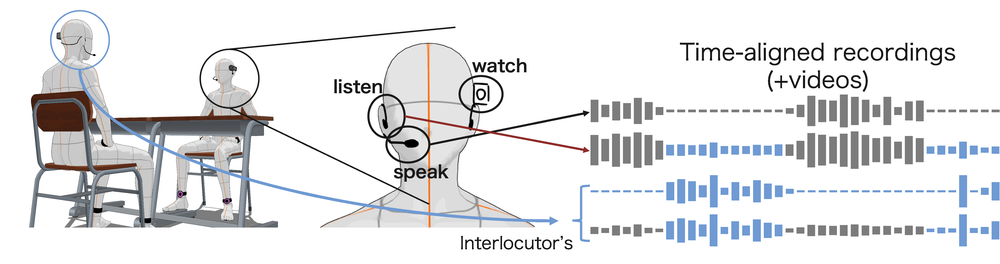

# SaSLaW Corpus

This repository introduces SaSLaW, our new dialogue speech corpus with audio-visual egocentric information.

Note that all of the contents of SaSLaW corpus are **in Japanese**.


<div style="text-align: center;">
    Contents of SaSLaW and its image about recording configuration.
</div>

<!-- The corpus name is the abbreviation of "**S**o, what **a**re you **S**peaking, **L**istening, **a**nd **W**atching?" -->

## How to Download SaSLaW

TBA

Use huggingface dataset or download directly from this zipfiles

## Contents

This corpus contains recordings of spontaneous dialogues between two individuals in a variety of (simulated) environment.

### Speakers

Four pairs (eight individuals) engaged in the recordings in total. SaSLaW labeled these speakers with the following IDs. Each item shows the pair of individuals:

- `spk01`, `spk02`: male, male
- `spk03`, `spk04`: male, male
- `spk05`, `spk06`: female, female
- `spk09`, `spk10`: male, male

Note that speakers with even-numbered IDs (spk02, spk04, spk06, spk10) sat in the same relative position in the recording room, as did speakers with odd-numbered IDs. Therefore you can use shared impulse responses for evaluating speakers with the even-numbered IDs and vice versa.

The total length of recorded speech utterances varied between 24 and 50 minutes across speakers.

### Corpus Structure and Format

The directory structure for the SaSLaW corpus is as follows:

```bash
user@yourpc:/path/to/SaSLaW$ tree

SaSLaW
├── spk01
│   ├── speech
│   │   ├── dialogue001.wav
│   │   ├── dialogue002.wav
│   │   ├── ...
│   ├── listen
│   │   ├── dialogue001.wav
│   │   ├── dialogue002.wav
│   │   ├── ...
│   └── video
│   │   ├── dialogue001.MP4
│   │   ├── dialogue002.MP4
│   │   ├── ...
│   ├── speech_segment
│   │   ├── dialogue001-seg00.wav
│   │   ├── dialogue001-seg01.wav
│   │   ├── ...
│   │   ├── dialogue002-seg00.wav
│   │   ├── dialogue002-seg01.wav
│   │   ├── ...
│   ├── listen_segment
│   │   ├── dialogue001-seg00.wav
│   │   ├── dialogue001-seg01.wav
│   │   ├── ...
│   │   ├── dialogue002-seg00.wav
│   │   ├── dialogue002-seg01.wav
│   │   ├── ...
│   ├── transcript_segment
│   │   ├── dialogue001-seg00.txt
│   │   ├── dialogue001-seg01.txt
│   │   ├── ...
│   │   ├── dialogue002-seg00.txt
│   │   ├── dialogue002-seg01.txt
│   │   ├── ...
│   ├── seg_info
│   │   ├── dialogue001.txt
│   │   ├── dialogue002.txt
│   │   ├── ...
│   ├── conf_env
│   │   ├── dialogue001.yaml
│   │   ├── dialogue002.yaml
│   │   ├── ...
├── spk02
│   ├── ...
├── spk03
├── ...
├── IR
│   ├── ir_even.wav
│   ├── ir_even_near.wav
│   ├── ir_odd.wav
│   └── ir_odd_near.wav
├── noiseonly
│   ├── cafe.wav
│   ├── cafeteria.wav
│   ├── ...
├── record_config
│   └── noise_config.yaml
```

For each speaker's data, SaSLaW provides the contents as follows:

- `speech`, `listen`, `video`
  - The whole recordings while a dialogue was conducting.
  - `speech` contains noise-suppressed speech.
  - `listen` contains first-person hearing sounds.
  - `video` contains first-person viewing videos.
- `speech_segment`
  - Speech segments derived from `speech`. Using the voice activity detection (VAD) in [pyannote.audio](https://github.com/pyannote/pyannote-audio) and manual corrections, the original recording of an entire conversation was segmented into individual utterances.
- `listen_segment`
  - Hearing-sound segments derived from `listen`. Each audio file contains the hearing sound when their interlocutor was speaking just before the corresponding speaker's utterance.
    - For instance, the audio file `dialogue024-seg04.wav` in `listen_segment` contains the hearing sound just before the utterance in `speech_segment/dialogue024-seg04.wav` which appears in `speech/dialogue024.wav`.
  - We picked up the section of the audio file from their interlocutor's `speech` segmentation results. In detail, the section is determined as their interlocutor's utterance section just before the corresponding speaker's speech segment.
- `transcript_segment`
  - Transcripts for speech segments in `speech_segment`.
  - The speech segments were transcribed by [openai/whisper-large-v2](https://huggingface.co/openai/whisper-large-v2) and manually corrected.
- `seg_info`
  - VAD results for `speech` by [pyannote.audio](https://github.com/pyannote/pyannote-audio).
  - Each file contains the list of utterance intervals in the corresponding speech recording.
    - Each row represents the (beginning, end) of the utterance.
- `conf_env`
  - Configuration of the audio environment (surrounding noise, relative position of pairs) while the dialogue was conducted.
  - For surrounding noise, we labeled the noise category and the noise power (its value in dB, and the stages of noise levels as `silent`, `moderate`, and `noisy`).
  - For the relative position, we labeled its stages as `near`, `moderate`, and `distant`.

This repository provides some codes snippets about the VAD, speech text transcription and hearing sound extraction by [pyannote.audio](https://github.com/pyannote/pyannote-audio) and [openai/whisper-large-v2](https://huggingface.co/openai/whisper-large-v2), (to generate `speech_segment`, `transcript_segment`, `listen_segment`). If you want to use it, please install required modules (in `requirements.txt`) and run the following scripts:

```bash
pip install requirements.txt
# To generate `speech_segment`, `transcript_segment` from `speech`
python scripts/segment_and_transcribe.py /path/to/SaSLaW/spk01
# To generate `listen_segment` (speech_segment, and transcript_segment required for both of the speaker pair)
python scripts/pick_listen_sound.py /path/to/SaSLaW/spk01 spk02
```

For environment-adaptive text-to-speech evaluation, we additionnally collected the several data:

- `IR`
  - Impulse responses of the recordings room.
    - For `near` position, please use the `ir_{even, odd}_near.wav`
    - For `moderate`, `distant` position, please use the `ir_{even, odd}.wav`.
- `noiseonly`
  - Noise-only hearing sound.
- `record_config/noise_config.yaml`
  - Configuration of the absolute gain values when you mix synthesized speech with noise-only hearing sound data during evaluation.

## Notes and Flaws

- We did not record the spk05's first-person videos due to technical issues.
- spk04 did not take on the ear-mounted microphone to record hearing sound from dialogue001 to dialogue011. We recorded the sound from that ear-mounted microphone while spk04 put it on the desk in front of them.
- spk10's hearing sounds (in `listen`) from dialogue001 to dialogue050 were monaural due to the flaws in our experiment flow.
- spk10's video in dialogue088 was corrupted. Therefore we did not provide it in the published contents.

## License

The contents (speech, hearing sound, video and any other configurations) of SaSLaW corpus are licensed under [Creative Commons Attribution-NonCommercial 4.0 International (CC BY-NC 4.0)](https://creativecommons.org/licenses/by-nc/4.0/).

## Contributors

Osamu Take / 武 伯寒 (University of Tokyo)

Shinnosuke Takamichi / 高道 慎之介 (@forthshinji, University of Tokyo)

Kentaro Seki / 関 健太郎 (University of Tokyo)

Yoshiaki Bando / 坂東 宜昭  (University of Tokyo)

Hiroshi Saruwatari / 猿渡 洋 (University of Tokyo)

## Paper Citation

```bibtex
@inproceedings{take2024saslaw,
    title={SaSLaW: Dialogue Speech Corpus with Audio-visual Egocentric Information Toward Environment-adaptive Dialogue Speech Synthesis},
    author={Osamu Take, Shinnosuke Takamichi, Kentaro Seki, Yoshiaki Bando, Hiroshi Saruwatari},
    booktitle={Proc. INTERSPEECH},
    year={2024}
}
```

## TODO

- [ ] Publish the corpus in huggingface dataset format
- [ ] Provide phoneme alignments